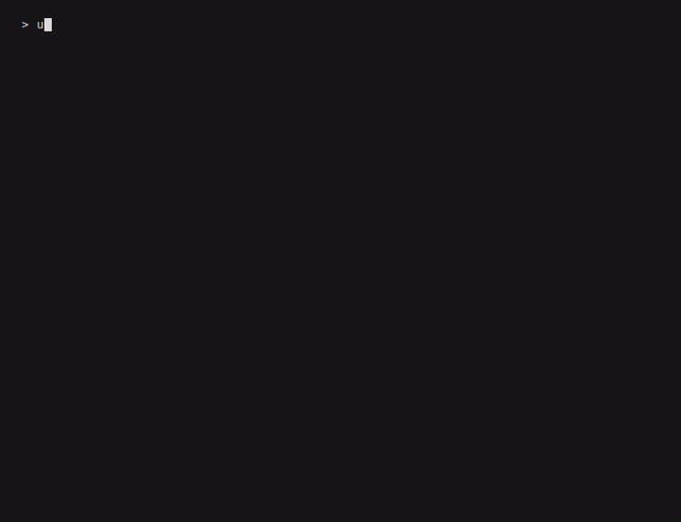

# Add an agent

First, make sure you have an understanding of the Rogue-Bench [CLI](cli.md).

In this tutorial we will walk through adding a new agent to the benchmark.

Currently, we only have the `NaiveAgent` class as our LLM-powered agent.

Here, we can make this even _more naive_. 

## Illustrative agent

Purely for illustration purposes, let's implement an agent that always moves left.

All agents need two things in Rogue-Bench:

- A class that extends `RogueAgent` defining the agent's behavior
- A Pydantic `AgentConfig` object that handles configuring the agent

First, let's define our agent.

## Agent implementation

We'll create a new file `src/rogue_bench/agent/left.py`. 

``` python 
class LeftAgent(RogueAgent):
    """Agent used in the docs tutorial: press left every turn."""

    def __init__(self, config: LeftAgentConfig) -> None:
        super().__init__(config)

    async def decide(self, screen: ScreenState, turn: int) -> RogueAction:
        return RogueAction(
            reasoning="I love moving left!",
            keys=["h"] * self.config.steps,
        )
```

The return value from the `decide` function is a `RogueAction` object. Reasoning is not a required return field. But, if provided, it will be displayed when running Rogue-Bench.

Next, we'll add our config object to this file.

``` python
class LeftAgentConfig(AgentConfig):
    """Config for LeftAgent."""

    steps: int = Field(
        default=1,
        ge=1,
        description="Number of left movements to queue each turn.",
    )
```

??? note "Click here to see the full `left.py` file"

    ``` python
    """Illustrative agent that always moves left."""

    from __future__ import annotations

    from typing import TYPE_CHECKING

    from pydantic import Field

    from rogue_bench.agent.base import AgentConfig, RogueAction, RogueAgent

    if TYPE_CHECKING:
        from rogue_bench.game.screen import ScreenState


    class LeftAgentConfig(AgentConfig):
        """Config for LeftAgent."""

        steps: int = Field(
            default=1,
            ge=1,
            description="Number of left movements to queue each turn.",
        )


    class LeftAgent(RogueAgent):
        """Agent used in the docs tutorial: press left every turn."""

        def __init__(self, config: LeftAgentConfig) -> None:
            super().__init__(config)

        async def decide(self, screen: ScreenState, turn: int) -> RogueAction:
            return RogueAction(
                reasoning="I love moving left!",
                keys=["h"] * self.config.steps,
            )

    ```

## Running the agent

Finally, we can fire up our agent. First, we can create a `config/left.json` file: 

``` json
{
    "steps": 2
}
```

Then run:

``` bash
rogue-bench --player agent \ 
    --agent-class left.LeftAgent \
    --agent-config config/left.json \
    --seed 8
```

Which will look like:



!!! note

    Note that the internal CLI handled constructing the Pydantic config object and sending it to the agent constructor.
