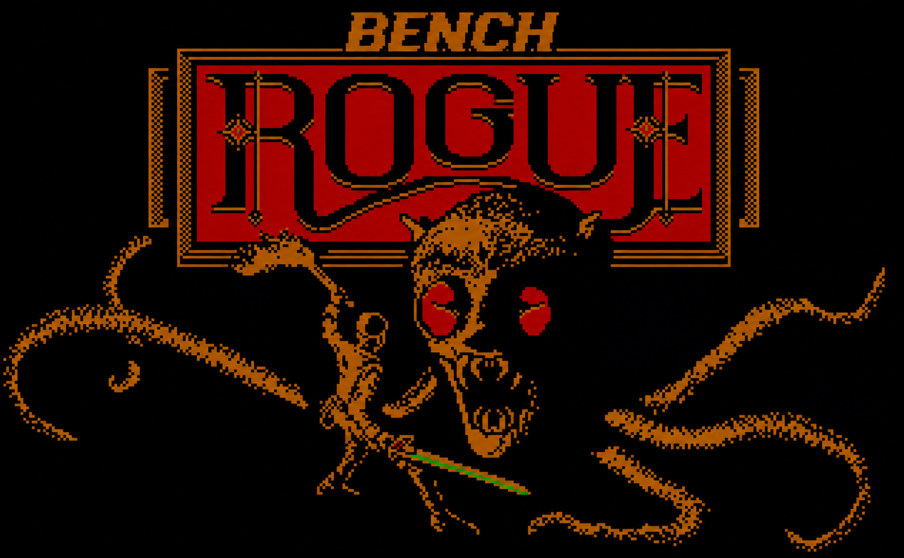

<p align="center">
  
</p>

Rogue-Bench is a benchmark where agents play [Rogue]("https://en.wikipedia.org/wiki/Rogue_(video_game)").

This work would not be possible without [Rogue Collection](https://github.com/mikeyk730/Rogue-Collection). If you just want to play Rogue, head over there.

Rogue-Bench seeks to test large language models' abilities playing a classic text based dungeon crawler. Once set up, you should be able to produce a result like this:

<p align="center">
  
</p>

## Get started

!!! note
    
    Rogue-Bench compilation and runs have been tested on (WSL2) Ubuntu 24.04. If you are struggling to get something working locally, try the Docker setup.

### Local

To run locally, execute:

``` bash
git clone --recursive https://github.com/iwhalen/rogue-bench.git 
cd rogue-bench
make install  # Install system level dependencies
make build    # Compile the custom headless Rogue executable
uv run rogue-bench --player human
```

This will start a "human" session where you can control Rogue with keyboard inputs. This is a good sanity check before setting up a real agent.

For all command line options, see:

``` bash
uv run rogue-bench --help
```

For more on the Rogue-Bench CLI, see [here](cli.md).

### Docker

To run Rogue in Docker, execute:

``` bash
git clone --recursive https://github.com/iwhalen/rogue-bench.git
cd rogue-bench
make build-docker
uv run rogue-bench --docker-image rogue-bench --player human
```

Again, this will start in "human" mode.

## How it works

Rogue-Bench runs a slightly modified, headless Rogue executable and communicates with it
over pipes. The Python library reads Rogue's terminal output, (optionally) parses it into a screen
state, and sends keystrokes back to the game.

No Rogue gameplay elements have been changed. Specifically, the version of Rogue is fixed to Unix Rogue 5.4.2.

Runs will accumulate statistics, metadata, and log keystrokes. This allows post-hoc analysis
as well as the ability to replay an entire run.

For more specifics on the implementation, see the [Github repository](https://github.com/iwhalen/rogue-bench).

## License

Note that the Python code for running Rogue-Bench is offered under the GPL-3.0 license.

The modified Rogue executables are under the same license(s) as the [Rogue Collection](https://github.com/mikeyk730/Rogue-Collection). At the time of writing, this is a mix of GPL-3.0 and other licenses. 

Rogue is a trademark of Epyx, Inc. Rogue-Bench is not associated with Epyx in any way.
